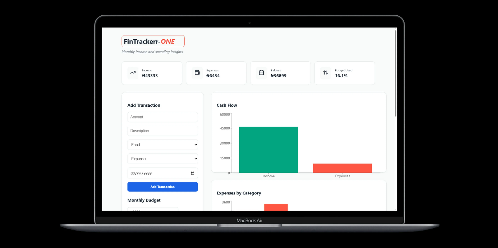

#Expense Tracker

A simple finance tracker I built to monitor income, expenses, and monthly spending habits. The goal is to make it easy to record transactions and quickly see where money is going without needing a backend.

## Features

* Add transactions with **amount, category, description, and date**
* Track **income and expenses**
* View **monthly totals** for income, expenses, and balance
* **Set a monthly budget** and see if spending is over or under
* **Charts for visualization** so spending patterns are easier to understand
* Data is saved using **localStorage**, so everything persists even after refresh

## Categories

The app tracks spending across common categories:

* Food
* Transport
* Bills
* Shopping
* Other

## Tech Used

* React + Vite
* lucide-react
* Recharts (for charts)
* LocalStorage for persistence
* Simple CSS layout

## Why i use the Tech stack

*React is smooth and condusive for an app that renders many components and it has some cool libraries like " lucide-react and recharts" which can be use for UI icons and better visualization of numeric data.

*Vite was use for fast development.

*Recharts : For better visualisation of Data.

*Vanilla CSS for ease styling and responsiveness

## Purpose

I built this as a small project to practice **state management, custom hooks, data visualization, and structuring a real-world dashboard UI** with React.

The idea was to keep the logic clean while still building something that resembles a real finance dashboard.

##Challenges Faced :
* 1, Time factor, i got the mail just 2 days to the deadline so it was a case of urgency for me, but thanks, past exprience, old legacy codes to readily available tools, it was possible.

* 2.Using reChart, the logic  can be demanding and the rechart being in a component is firing a warning to the console, but it nothing serious.

  ##Time Taken : 18hrs

